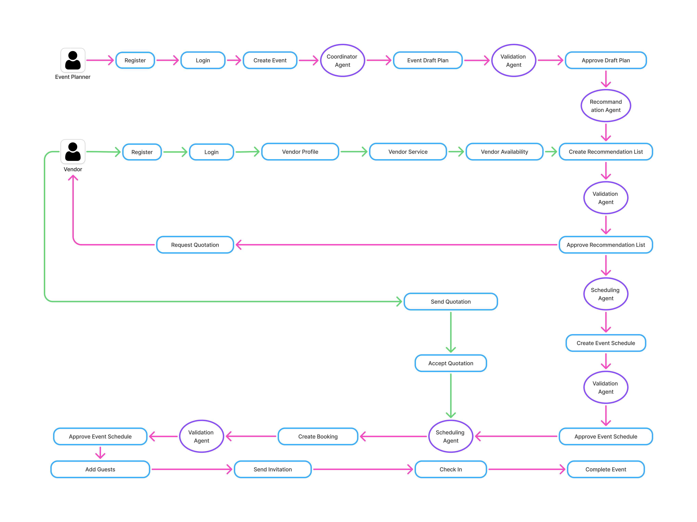
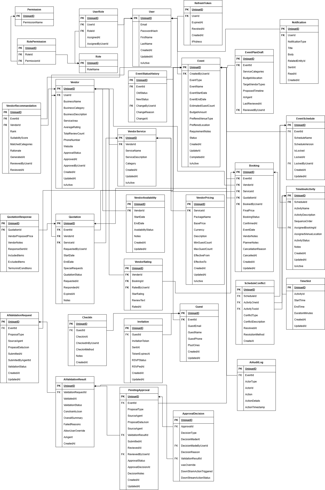

# Event Planning & Coordination Platform

A 4-person, 2-month full-stack project: REST API backend, React web, Flutter mobile, and AI planning service.

## Project workflow


## Relationship Schema Diagram



## 13. Root-Level Repository Structure

```
project-root/
│
├── backend/                      # .NET layered-architecture API (Section 3)
│   ├── src/{Api,Application,Domain,Infrastructure}/
│   └── tests/
│
├── web/                          # React app, feature-based (Section 5)
│   └── src/{features,shared,routes}/
│
├── mobile/                       # Flutter app, feature-based (Section 6)
│   └── lib/{core,features,config}/
│
├── agentic-ai/                   # LangGraph AI service (Section 7)
│   ├── src/{agents,workflows,tools,prompts,approval,models,services,state,config,logging}/
│   └── tests/
│
├── docs/                         # minimal, high-value docs only (Section 12)
│   ├── architecture/
│   ├── api/
│   ├── database/
│   ├── ai/
│   ├── setup/
│   └── decisions/
│
├── .github/                      # from your CI/CD guide: workflows, templates, CODEOWNERS
│   ├── workflows/
│   ├── ISSUE_TEMPLATE/
│   ├── PULL_REQUEST_TEMPLATE.md
│   └── CODEOWNERS
│
├── AGENTS.md                     # AI coding-agent instructions (from CI/CD guide)
├── CONTRIBUTING.md               # local setup + Definition of Done
├── .gitignore
└── README.md
```

## Quick Start

See [CONTRIBUTING.md](CONTRIBUTING.md) for full local development setup.

```bash
# Clone the repository
git clone https://github.com/SE3090-GROUP-SE029/event-planning-platform.git

cd event-planning-platform
git pull origin dev

# Backend
cd backend
dotnet restore
dotnet ef database update
dotnet run

# Web (new terminal)
cd web
npm install
npm run dev

# Mobile (new terminal)
cd mobile
flutter pub get
flutter run

# AI (new terminal)
cd agentic-ai
python -m venv venv
source venv/bin/activate  # or venv\Scripts\activate on Windows
pip install -r requirements.txt
python -m uvicorn src.main:app --reload