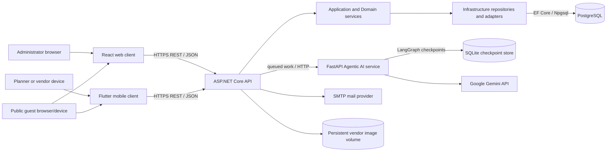
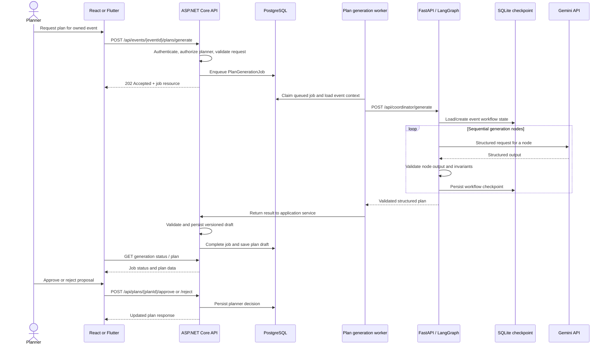
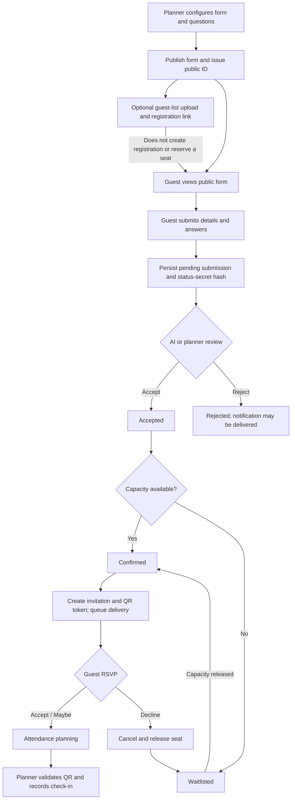
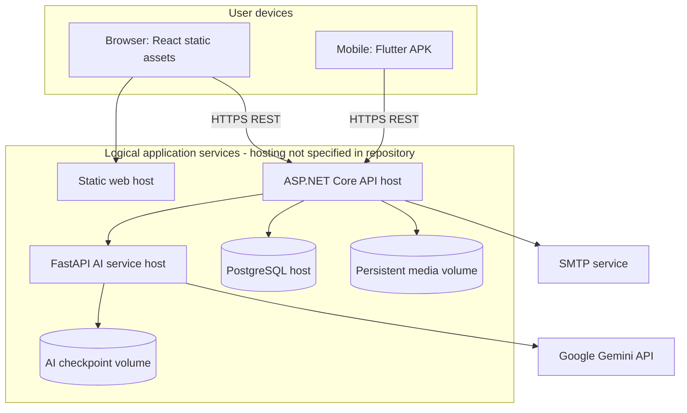

# Event Planning and Coordination Platform
## Project Overview, Requirements Specification and Technical Architecture Report

**Report date:** 5 October 2026  
**System name:** Plan It Event Planning and Coordination Platform  
**Evidence basis:** Repository source, manifests, migrations, configuration examples, CI workflows, and existing project documentation.

> **Scope note.** No `docs/architecture.md` is present in this checkout. The report therefore describes the implementation visible in the repository rather than an assumed target design. The worktree contained pre-existing uncommitted changes during inspection; conclusions describe that inspected working-tree state and should not be interpreted as a release certification. Several requested topics (notably the university assignment's exact AI-declaration format and a chosen production cloud provider) are not specified in the repository. Those are explicitly identified below rather than invented.

## 1. Executive summary

The platform brings event organizers, vendors, and guests into one service for planning events and coordinating their execution. Organizers maintain events, generate and review AI-assisted plans, select suppliers, request quotations, create schedules, publish guest-registration forms, review submissions, allocate seats, send invitations, and check guests in. Vendors manage business profiles, service offerings and availability, respond to quotations, and follow assigned schedule activities. Guests use public registration and status flows without maintaining a platform account.

The implementation is a multi-client, service-oriented system: React provides an administrator web portal; Flutter provides the role-oriented mobile application; an ASP.NET Core REST API implements core business rules, authorization, persistence, and asynchronous jobs; PostgreSQL stores operational data through Entity Framework Core; and a Python FastAPI service provides LLM-backed planning, recommendations, question suggestions, and registration reviews. Google Gemini is the configured generative-model provider. The backend remains the authoritative boundary for business state and persists completed plans and workflow outcomes.

The repository contains working application code and test/CI workflows, but it does **not** contain a production infrastructure definition, a cloud deployment manifest, a database hosting manifest, or a complete production release pipeline. The README provides a Render persistent-disk example for vendor images; this is guidance, not evidence of a selected or provisioned production platform.

## 2. Business problem and objectives

### 2.1 Business problem

Event planning is a multi-party coordination activity involving budgets, dates, suppliers, venue and service requirements, contracts, schedules, guest lists, capacity limits, communications, and attendance. Fragmented spreadsheets, email threads, and disconnected tools make it difficult to preserve one consistent event state, compare supplier proposals, coordinate schedule changes, and track guest decisions and check-in.

The platform addresses that coordination problem by providing shared event records, role-specific workflows, structured vendor and booking data, a controlled guest lifecycle, and AI-generated planning assistance that can be reviewed by a human organizer.

### 2.2 Project objectives

1. Provide a single API-backed system of record for event, vendor, booking, schedule, planning, and guest-registration data.
2. Give event planners and vendors role-appropriate workflows on mobile, with an administrator-focused web portal.
3. Automate repetitive planning tasks through structured AI suggestions while retaining human control over key business decisions.
4. Manage registrations as a traceable lifecycle from public form submission through review, seat allocation, invitation, RSVP, and check-in.
5. Protect role-restricted operations through server-side authentication, authorization, event ownership checks, and data constraints.
6. Support asynchronous work and transient provider failures without blocking core API request handling indefinitely.
7. Provide automated build, test, analysis, and migration checks for the backend, web client, mobile client, and AI service.

### 2.3 Functional scope

**Included:** user registration and login; role-based access; planner event management; AI plan generation and approval; vendor marketplace and profiles; service, gallery and availability management; quotations and bookings; event schedules, activities and conflict handling; guest-list upload; configurable public registration forms; manual and AI-assisted guest review; seat allocation and waitlisting; invitation and RSVP; QR check-in; dashboards and analytics; and development/test integration endpoints.

**Not evidenced as implemented or production-ready:** a committed cloud topology, infrastructure-as-code, container orchestration, a CI workflow that deploys the system, a selected managed PostgreSQL provider, a centralized monitoring/alerting stack, and a fully specified payment or event-ticketing system. The report does not infer those capabilities.

## 3. Users, permissions and principal workflows

### 3.1 User roles

| Role | Primary goals | Evidence-based access summary |
|---|---|---|
| **Administrator (`ADMIN`)** | Operate the web portal, oversee users, events, vendors, plans, schedules, and system health. | React protected routes require `ADMIN`. Backend has admin-only policies and admin controllers. |
| **Event planner / organizer (`EVENT_PLANNER`)** | Create and maintain owned events; generate and decide on plans; manage schedules, supplier requests, bookings, and guest registration. | Backend planner policy is role-based and services additionally check event ownership. Flutter routes gate planner features by role. |
| **Vendor (`VENDOR`)** | Maintain a vendor profile, services, images and availability; answer quotations; track assigned activities and bookings. | Backend vendor policy plus per-vendor identity checks; Flutter routes gate vendor workflows by role. |
| **Guest / public registrant** | View a published form, submit registration, check status, respond to an invitation, and present its QR credential. | Public registration endpoints are anonymous; status/RSVP operations require a high-entropy status secret and invitation operations use a token. No guest login role is evidenced. |
| **Background workers / AI service** | Process plan jobs, recommendations, guest review, invitations, delivery and seat allocation. | Service identities are internal application components, not interactive user roles. Their actions are initiated by authorized API paths and queued work. |

### 3.2 Role-permission matrix

| Capability | Administrator | Event planner | Vendor | Public guest |
|---|---:|---:|---:|---:|
| Web administration portal | Yes | No (web guard rejects non-admin roles) | No | No |
| Create and manage own events | Administrative oversight | Yes, with ownership enforced | No | No |
| Generate, view, approve or reject an event plan | Admin read access; decision role is planner policy | Yes, for owned events | No | No |
| Maintain vendor profile, offerings, images and availability | Admin review/approval operations | Browse marketplace | Yes, own vendor record | No |
| Request/answer quotations and manage booking lifecycle | Administrative oversight | Request/accept and review | Respond and fulfil | No |
| Edit event schedule / generate AI schedule | No general planner editing grant is evidenced | Yes, for owned events | See assigned work; update permitted activity status | No |
| Configure a form, review registrations, adjust seat limit, check in | No general planner endpoint grant is implied by role name alone | Yes, with planner access filter and event ownership | No | No |
| Register, read registration status, RSVP | No | No | No | Yes, by public identifiers and secret |

Authorization in the API is authoritative; client-side route guards improve navigation and UX but are not a substitute for server enforcement. Some admin surfaces return aggregate read data while planner mutation paths require `EVENT_PLANNER`. Exact operation-level distinctions are included in the API inventory below.

**Integration caveat:** the React portal's protected route admits only `ADMIN`, while the form-management API uses `PlannerAccessFilter` and requires an `EVENT_PLANNER` claim. The portal includes guest-management pages that call this planner-facing API. Unless an account has both claims or an administrative bridge exists elsewhere, those web workflows may be denied. No such role bridge is documented in the inspected code; confirm the intended role model and test this end-to-end.

### 3.3 Major workflows

1. **Account and onboarding:** a user registers or logs in; the API issues access and refresh credentials; the mobile app restores a saved session and routes the user according to role.
2. **Event-to-plan:** an event planner creates an event; submits an asynchronous generation request; a hosted backend worker sends an event snapshot to the AI service; the returned plan is validated and persisted as a versioned draft; the planner reviews and approves or rejects it.
3. **Vendor sourcing:** the planner browses approved marketplace vendors, requests quotations for a service and date window, compares vendor responses, accepts a quotation into a booking, and tracks fulfilment.
4. **Schedule coordination:** an organizer creates or requests an AI-generated schedule, edits activities and vendor assignments, reviews time conflicts, and shares relevant assigned activities with vendors.
5. **Guest lifecycle:** a planner configures and publishes a form, optionally uploads a guest list, and shares the public URL. A guest submits details and answers; AI or a planner reviews the submission; the backend allocates capacity and waitlist positions; confirmed guests receive invitations and QR credentials; guests RSVP; planners check them in. See the state transitions in `docs/ai/guest-lifecycle.md`.
6. **Administration:** an administrator uses the web dashboard for platform-level event, vendor, plan, schedule, user and analytics views.

## 4. Functional and non-functional requirements

The following specification is derived from implemented repository behaviour; it is not a substitute for a separately approved assignment requirements document.

### 4.1 Functional requirements

| ID | Requirement |
|---|---|
| FR-01 | The system shall allow a user to register and authenticate, and shall expose the authenticated user's identity and roles. |
| FR-02 | The system shall issue and refresh access credentials and support refresh-token logout/revocation. |
| FR-03 | The system shall permit an event planner to create, retrieve, list, update and delete events subject to authorization and ownership checks. |
| FR-04 | The system shall accept a planner's request to generate a plan asynchronously and expose job status for polling. |
| FR-05 | The system shall persist structured plan drafts with version, validation results, risks, missing requirements, rationale and planner decision metadata. |
| FR-06 | The system shall allow authorized planners to approve or reject a generated plan. |
| FR-07 | The system shall expose an approved vendor marketplace and permit a vendor to manage its own profile, service offerings, gallery and availability. |
| FR-08 | The system shall support quotation requests, vendor responses, planner acceptance, booking changes/cancellation/completion and review operations. |
| FR-09 | The system shall allow an authorized planner to create, edit and remove schedule activities, inspect detected conflicts, and request AI schedule generation. |
| FR-10 | The system shall allow a vendor to view assigned schedule activities and update permitted activity status. |
| FR-11 | The system shall allow a planner to create, configure and publish one registration form per event and select registration questions. |
| FR-12 | The system shall accept bounded guest-list uploads and support sending registration links, without treating an upload as a completed registration. |
| FR-13 | The system shall accept public registrations only when the associated form is open and collect required fields plus selected answers. |
| FR-14 | The system shall record review decisions and sources, and shall permit a planner to manually review or override eligible AI review outcomes. |
| FR-15 | The system shall allocate seats in registration order, place over-capacity accepted submissions on a waitlist, and promote eligible waitlisted submissions when capacity is released. |
| FR-16 | The system shall issue an invitation and QR credential only after confirmation, support RSVP, and release a seat when a confirmed registration is cancelled or declined. |
| FR-17 | The system shall validate invitation credentials and record at most one check-in per registration. |
| FR-18 | The system shall expose planner and administrator dashboard/analytics views that correspond to their authorization scope. |
| FR-19 | The system shall expose health and integration diagnostics used by the services and development workflows. |
| FR-20 | The system shall validate AI-generated objects against strict schemas and business invariants before saving or applying the result. |

### 4.2 Non-functional requirements

| ID | Requirement / evaluation criterion |
|---|---|
| NFR-01 — Security | Enforce authentication, role authorization, and resource ownership on the server; never rely on client route checks alone. |
| NFR-02 — Confidentiality | Protect credentials and status secrets in storage and transport; keep provider keys and production configuration outside source control. |
| NFR-03 — Integrity | Enforce unique identities, valid lifecycle states, event/form consistency, capacity and time-window rules in application logic and database constraints. |
| NFR-04 — Reliability | Queue long-running plan/review/delivery work, track statuses and attempts, and handle transient provider/network failures with bounded timeouts and retry/fallback policy. |
| NFR-05 — Recoverability | Persist backend business outcomes and coordinator checkpoints; preserve key rings and persistent media storage in deployments that need restart recovery. |
| NFR-06 — Performance | Avoid tying long AI work to an interactive request; use indexed lookups for common ownership, status, time-window, public-reference and identity queries. |
| NFR-07 — Usability | Present role-specific screens, public guest access without account creation, progress/status views, actionable validation feedback and consistent visual design. |
| NFR-08 — Compatibility | Maintain the .NET 8, React/Vite, Flutter and Python runtime baselines declared by project manifests and CI. |
| NFR-09 — Maintainability | Separate API, application, domain and infrastructure concerns; organize client code by feature; centralize DTO validation and typed state where used. |
| NFR-10 — Observability | Record operation outcomes, correlation/request identifiers, AI provider health and workflow/job states without logging secrets or unnecessary personal data. |
| NFR-11 — Portability | Keep service configuration environment-driven; distinguish local-development defaults from production values. Current production portability still requires deployment engineering. |

### 4.3 Representative user stories

- As an **event planner**, I want to create an event and receive a structured AI plan so that I can start from a documented proposal instead of a blank page.
- As an **event planner**, I want to review, edit or reject a generated plan so that AI suggestions do not become binding commitments without my decision.
- As an **event planner**, I want to compare vendor offerings and quotations so that supplier choices match my event budget and schedule.
- As a **vendor**, I want to manage my profile, services and availability so that planners can evaluate accurate information.
- As a **vendor**, I want to respond to a quotation and see assigned schedule activities so that I can confirm and deliver contracted work.
- As an **event planner**, I want to publish a configurable registration form so that guests can provide event-specific information.
- As a **guest**, I want to submit a registration and securely view its status so that I can understand whether I am accepted, waitlisted or invited.
- As an **event planner**, I want to see AI review evidence and make a manual decision so that automation assists rather than replaces accountable judgment.
- As an **event planner**, I want capacity-based waitlisting and automatic promotion so that seats remain allocated consistently.
- As a **guest**, I want to RSVP using my invitation so that the organizer can plan attendance.
- As a **planner**, I want to scan a QR invitation at the event so that attendance is recorded efficiently.
- As an **administrator**, I want platform-level analytics and vendor review tools so that I can oversee service operations.
- As a **mobile user**, I want my session restored securely and see only role-appropriate navigation so that I can resume work on my device.

## 5. Integrated architecture

### 5.1 Architectural overview and component responsibilities

| Component | Responsibility | Main implementation evidence |
|---|---|---|
| React web client | Administrator portal, public landing and guest registration/status pages; route loading; API queries and mutations. | `web/src/App.jsx`, `web/src/routes/`, `web/src/features/`, `web/src/shared/` |
| Flutter mobile client | Planner/vendor workflows, public guest registration, device camera/file/image interaction, authenticated API communication. | `mobile/lib/main.dart`, `mobile/lib/features/`, `mobile/lib/core/` |
| ASP.NET Core API | REST boundary, identity/authorization, validation, orchestration of business services, EF persistence, asynchronous workers and media serving. | `backend/src/Api/Program.cs`, `backend/src/Api/Controllers/` |
| Application and Domain layers | Business operations/contracts, lifecycle rules, entities and enumerations separated from transport and provider details. | `backend/src/Application/`, `backend/src/Domain/` |
| Infrastructure layer | EF Core/Npgsql persistence, repositories, external service clients, password/token utilities, local image storage and email integration. | `backend/src/Infrastructure/` |
| PostgreSQL | Durable relational source of truth for users, events, vendors, schedules, bookings, registrations, plans and jobs. | `backend/src/Infrastructure/Data/`, `backend/src/Infrastructure/Migrations/` |
| Agentic AI service | FastAPI endpoints, LangGraph plan workflow, Google ADK guest/question agents, schedule and vendor-analysis calls, Gemini client, checkpointing and provider failure handling. | `agentic-ai/src/` |
| External integrations | Gemini model API; SMTP mail delivery; platform device camera, image and file pickers. | Agent config/client, backend guest services, `mobile/pubspec.yaml` |

The clients call ASP.NET Core; the clients do not normally call the AI service directly. The API performs authorization and business validation, then calls AI where required. The AI service does not own the business database; coordinator results are validated and persisted by the backend. The AI service has a SQLite checkpoint database for its resumable coordinator graph. Vendor media is stored on a local filesystem path configured for the API, so a production host must provide durable shared storage if the API is ephemeral or scaled horizontally.

### 5.2 Component diagram

### 5.3 Data flow

1. **Web/mobile to API:** route and feature screens call shared/feature-specific Axios or Dio data sources. JSON DTOs and selected multipart uploads cross the REST boundary. The API extracts identity and role claims from a JWT, applies endpoint policy and resource ownership checks, validates request values, then invokes application services.
2. **API to PostgreSQL:** repositories use `AppDbContext`; EF Core maps domain entities and migrations to PostgreSQL. Reads/writes include lifecycle transitions and relational constraints. Date/time values are normalized before `SaveChanges`.
3. **API to AI:** the backend's hosted workers or application services call configured Agentic AI HTTP routes. For event planning, the API enqueues a job; the worker sends event context to the coordinator; validated response data is persisted as an `EventPlanDraft`. Schedule and recommendation workflows similarly return through the backend.
4. **AI to Gemini:** the coordinator and specialist agents construct bounded structured prompts; the Gemini client handles model selection, key rotation, retries, deadlines, schemas and provider errors. Structured output is revalidated using application models before a successful service response.
5. **API to communications/media:** invitation and rejection delivery workers use configured SMTP; vendor image streams are validated and persisted through the configured local storage adapter and served as static files.
6. **Public guest access:** public endpoints do not issue a user session. Random public references and registration status secrets protect status/RSVP access; invitation tokens support QR validation and check-in.

### 5.4 Plan-generation sequence diagram

### 5.5 End-to-end guest workflow

## 6. Agentic AI architecture

### 6.1 Service shape and agent inventory

The Python service uses FastAPI and Pydantic; dependencies include LangGraph, SQLite checkpoint support, Google ADK, and Gemini SDK packages. It exposes several specialized workflows rather than one autonomous agent with unrestricted tools.

| Agent/workflow | Input | Output and responsibility | Tool access / execution |
|---|---|---|---|
| **Coordinator plan graph** | Event snapshot: type, date, location, guest count, budget, requirements and timestamps. | Structured service categories, target vendor types, budget distribution, proposed timeline, risks, missing requirements, completeness score and rationale. | Sequential LangGraph nodes: requirement analysis, service categorization, timeline, budget, risk assessment, missing requirements, deterministic completeness, rationale and self-validation. Gemini is called through service code; there are no arbitrary external tools attached to the graph. |
| **Guest filtering/review agent** | Guest data, event requirements, selected questions and answers, bounded same-event comparison records. | `ACCEPTED`/`REJECTED`, confidence, short reasons and issue flags. It is explicitly told not to infer identity, protected traits or unverified facts. | Google ADK `LlmAgent`, structured output schema, no tools. The backend queues and applies the automated review under registration lifecycle rules. |
| **Registration-question agent** | Event name and supplied requirement notes. | One to ten suggested questions with required/optional flags. Suggestions are not published automatically; the planner selects questions. | Google ADK `LlmAgent`, structured schema, no tools. |
| **Schedule generation** | Schedule/event details and relevant activity context passed by the backend. | Structured schedule generation response consumed by the backend schedule service. | The backend owns the schedule API and validation; AI service exposes `/api/schedules/generate`. This is a suggestion path, not a direct database mutation by the model. |
| **Vendor analysis/recommendation** | An event/plan and a backend-pre-filtered list of candidate vendors. | Candidate-constrained rankings/reasons matching vendor IDs from the supplied set. | FastAPI route `/api/vendor-analysis/recommend`; server validation rejects output that does not correspond to supplied candidates. |

The backend also contains a separate Google ADK guest-review client integration and durable review worker. The models and services are separated so provider-specific prompt execution does not become the persistence authority.

### 6.2 Orchestration, state persistence and human approval

- The coordinator is an explicit **sequential LangGraph state graph** with a pre-run event snapshot, generation nodes, self-validation, bounded retry routing and terminal plan/error paths.
- An `AsyncSqliteSaver` checkpoint store is created at service startup. The default path is `.data/coordinator-checkpoints.sqlite`; incomplete checkpoints older than the configured TTL (168 hours by the example/default) are pruned. The checkpoint thread is keyed using event identity, graph version and event-input fingerprint, so a retry with unchanged input can resume without conflating changed input. Completed plan business data is saved by the backend and the temporary checkpoint is removed. SQLite files must be protected at rest and are not a shared multi-replica store.
- Google ADK guest/question calls use per-invocation in-memory sessions, rather than a persistent conversation history. The backend persists review evidence, prompt/model metadata and workflow status in PostgreSQL.
- **Human approval is an application-level step, not an AI tool or graph interrupt.** The coordinator returns a proposal; the backend persists it; an authorized planner reviews and approves/rejects it using plan endpoints. For question suggestions the planner must select questions. Guest decisions are configured to be automatically applied by the backend, but planners have review/override operations subject to lifecycle constraints. Vendor recommendations are restricted to supplied candidates and are presented to planners for selection. The repository does not show a generic human-in-the-loop LangGraph interrupt/approval queue.

### 6.3 Validation and failure handling

1. Request models and configuration use Pydantic/settings validation.
2. ADK callback validates and logs generation configuration and schemas before provider calls; sensitive user text is redacted from request logs.
3. Gemini output is parsed/validated against strict application models. The coordinator runs deterministic completeness and self-validation; it routes validation failures through bounded retries and explicit terminal failure.
4. Vendor recommendations are checked against the supplied candidate set. Backend services validate AI data and business rules again before persistence.
5. Gemini client handles 429 cooldown/key rotation; retries transient 500/502/503/504 once on the same key, then fails over; timeout and transport errors rotate keys; invalid credentials mark the key failed; invalid argument stops rotation. Configured operation deadlines bound overall work.
6. Service routes map timeout, quota/rate limit, network, model, credentials, invalid-configuration and schema errors to explicit HTTP status and machine-readable `detail.code` values; selected transient errors include `Retry-After`.
7. Backend jobs/reviews retain state, attempt metadata, and failure codes. Invitation delivery and registration-review workers can retry or be retried by planners. Cancellation tokens, operation deadlines and job states provide bounded failure paths.

### 6.4 Security controls and observability

**Observed controls:** provider keys are configured through environment settings; the service validates environment and explicit CORS origins; guest-review and question-suggestion endpoints restrict requests to loopback clients; system prompts mark event and guest content untrusted; ADK agents have no tools; responses use constrained schemas; vendor outputs are candidate-bound; coordinator state is separately checkpointed; key diagnostics expose counts/health rather than raw keys; logs use masked key suffixes and approximate token estimates; model calls have timeouts; output is revalidated.

**Residual considerations:** loopback source checks are suitable only when network topology makes the backend appear as loopback; container/multi-host deployments need an authenticated service-to-service trust mechanism rather than assuming loopback. Checkpoint volumes contain event input and generated state and need access control, encryption-at-rest and retention controls. The service is configured with broad methods/headers for its allowlisted CORS origins. The coordinator logs generated plan output, which can include user-supplied event details; production logging should apply data minimization and retention. Prompt instructions reduce but cannot eliminate prompt-injection risk; deterministic server-side authorization and validation remain essential.

**Observability evidence:** structured logs record workflow nodes, selected model/key index, masked key suffix, retry reason, status/failure category, estimates, timeouts, operation context and startup key-pool diagnostics. Backend job/review rows expose status and attempt metadata; admin API has a health endpoint; AI service exposes `/health`. No repository evidence was found for distributed tracing, metrics export, alert routing, or a production monitoring stack.

## 7. Database design

### 7.1 Persistence model and entity groups

The relational model is defined by Domain entities and explicit EF Core configurations, then versioned through migrations. PostgreSQL is accessed through Npgsql. The entity set includes:

- **Identity and access:** `User`, `Role`, `UserRole`, `RefreshToken`.
- **Events and generated plans:** `Event`, `EventPlanDraft`, `PlanGenerationJob`, `EventSnapshot`, `IdentifiedRisk`, `MissingRequirement`.
- **Vendor marketplace and fulfilment:** `Vendor`, `VendorOffering`, `VendorGalleryImage`, `VendorAvailability`, `VendorRecommendationRun`, `VendorRecommendationItem`, `Quotation`, `Booking`, `VendorRating`.
- **Schedule:** `EventSchedule`, `TimelineActivity`, `ScheduleConflict`.
- **Guest lifecycle:** `RegistrationForm`, `RegistrationQuestion`, `Guest`, `RegistrationSubmission`, `RegistrationAnswer`, `GuestAiReview`, `Invitation`, `GuestCheckIn`.
- **Development/test:** `TestMessage`.

Enums encode lifecycle and domain categories including event, booking, quotation, registration, RSVP, delivery, plan-generation, AI-review, vendor, risk and activity states.

### 7.2 ER diagram

The diagram emphasizes principal aggregates and cardinalities encoded by EF configuration. JSON-owned plan values are shown as attributes of `EVENT_PLAN_DRAFT`, rather than relational child tables.

```mermaid
erDiagram
    USER ||--o{ USER_ROLE : assigned
    ROLE ||--o{ USER_ROLE : grants
    USER ||--o{ REFRESH_TOKEN : owns
    USER ||--o{ EVENT_PLAN_DRAFT : authors
    EVENT ||--o{ EVENT_PLAN_DRAFT : versioned_plans
    EVENT ||--o{ PLAN_GENERATION_JOB : generates
    USER ||--o{ PLAN_GENERATION_JOB : requests
    EVENT_PLAN_DRAFT o|--o| PLAN_GENERATION_JOB : result
    EVENT ||--o| REGISTRATION_FORM : configures
    EVENT ||--o{ GUEST : invites
    REGISTRATION_FORM ||--o{ REGISTRATION_QUESTION : defines
    REGISTRATION_FORM ||--o{ REGISTRATION_SUBMISSION : receives
    GUEST ||--o| REGISTRATION_SUBMISSION : submits
    REGISTRATION_SUBMISSION ||--o{ REGISTRATION_ANSWER : includes
    REGISTRATION_QUESTION ||--o{ REGISTRATION_ANSWER : answered_by
    REGISTRATION_SUBMISSION ||--o| GUEST_AI_REVIEW : reviewed
    REGISTRATION_SUBMISSION ||--o| INVITATION : receives
    REGISTRATION_SUBMISSION ||--o| GUEST_CHECK_IN : checked_in
    EVENT_SCHEDULE ||--o{ TIMELINE_ACTIVITY : contains
    EVENT_SCHEDULE ||--o{ SCHEDULE_CONFLICT : reports
    VENDOR ||--o{ VENDOR_OFFERING : lists
    VENDOR ||--o{ VENDOR_GALLERY_IMAGE : displays
    VENDOR ||--o{ VENDOR_AVAILABILITY : declares
    EVENT ||--o{ QUOTATION : requests
    VENDOR ||--o{ QUOTATION : responds
    VENDOR_OFFERING ||--o{ QUOTATION : quotes
    QUOTATION ||--o| BOOKING : accepted_as
    EVENT ||--o{ BOOKING : schedules
    VENDOR_OFFERING ||--o{ BOOKING : fulfils
    EVENT ||--o{ VENDOR_RECOMMENDATION_RUN : analyzed_for
    EVENT_PLAN_DRAFT ||--o{ VENDOR_RECOMMENDATION_RUN : based_on
    VENDOR_RECOMMENDATION_RUN ||--o{ VENDOR_RECOMMENDATION_ITEM : contains
    VENDOR ||--o{ VENDOR_RECOMMENDATION_ITEM : candidate
    VENDOR_OFFERING ||--o{ VENDOR_RECOMMENDATION_ITEM : candidate_service
```

> **Cardinality caveat:** the generation-job index permits multiple historical jobs but only one queued/processing job per event; the recommendation-run uniqueness is filtered by status and event/plan. `EventSchedule` stores an `EventId` scalar, but the inspected model/migration does not establish a foreign key or unique constraint to `Event`; schedule cardinality is therefore unknown, and the schedule is intentionally shown without an ER edge to `Event`. `Event.OwnerId` and `Vendor.UserId` also have indexes (the latter unique), but the inspected entity configurations do not establish corresponding foreign keys; the application uses them for ownership/identity lookups. Other relations for ratings and user-role join rows are more detailed than can be inferred from this summary diagram. Refer to the concrete `IEntityTypeConfiguration<T>` classes and migration snapshot before making schema changes. The logical diagram is for the academic overview and is not a migration script.

### 7.3 Relationships, keys and constraints

- Primary keys are predominantly UUID/GUID identifiers; guest registration submissions use a numeric `long` identity. `RegistrationAnswer` uses a composite key `(RegistrationSubmissionId, RegistrationQuestionId)`. Guest check-in uses `RegistrationSubmissionId` as its key, enforcing one check-in per registration.
- Composite alternate keys on form/event, guest/event, submission/form and question/form support composite foreign keys that prevent cross-event or cross-form references.
- One registration form per event, unique public form IDs, one guest per event-normalized email, unique registration references, unique status linkage, unique invitation tokens and one booking per quotation are enforced with unique indexes.
- Database checks validate event budget/non-negative and guest count/time window; form period, positive seats and publication/status consistency; recognized registration states; positive plan versions and completeness range; and AI review state/result/lease consistency.
- Required fields have configured maximum lengths and monetary columns use fixed precision. Enums are persisted using bounded strings for many state fields.
- Delete behaviours are explicit: restrictive relationships protect historical guest and plan/decision data; event-owned plan drafts cascade where configured.

### 7.4 Indexing and normalization

**Indexing strategy observed:** unique index on user email and vendor-user identity; status and creation-time composite indexes for queued jobs/reviews; `(EventId, Version)` and `(EventId, Status)` for plans; event/status/registered-time/id ordering for submissions; unique normalized guest email within an event; unique public form/reference/token keys; and time-window indexes for vendor bookings/availability where configured. This supports login, ownership, work-queue claiming, plan history, guest lookup, public access and schedule/vendor operations.

**Normalization:** core business concepts are separated into identity, event, vendor, booking and registration relations, reducing update anomalies and preserving referential integrity. The answer bridge table models submission-to-question answers. Event-plan generated content (budget, categories, timeline, snapshot, risks and missing-requirement collections) is intentionally stored as JSON/JSONB in a versioned plan aggregate. This hybrid design preserves flexible AI output without making each proposal attribute a fixed relational table; querying individual JSON members and enforcing fine-grained constraints is consequently less convenient than for normalized scalar columns.

### 7.5 Audit fields and migration strategy

Entities use timestamps where lifecycle needs them (for example created/updated, generated, submitted, reviewed, RSVP, delivery, check-in, cancellation and completion times). `AppDbContext` normalizes tracked `DateTime` and `DateTimeOffset` values before saves. `EventPlanDraft` includes a configured shadow `LastAuditAt`, and plan records include creator/approver/rejector references and versioning. There is no uniform base audit entity or general-purpose immutable audit-event table evidenced; auditability is therefore domain-specific rather than comprehensive change history.

Schema evolution is intended to be through EF migrations, not direct database edits. The working tree contains migration sources for initial creation, guest registration, AI reviews/questions/decisions, registration-answer adjustments, vendor recommendation lifecycle, protected registration status secrets, plan generation jobs and separated guest lifecycle. **Migration evidence caveat:** migration sources are split between `backend/src/Infrastructure/Migrations/` and `backend/src/Infrastructure/Data/Migrations/`. The two inventories contain separate IDs; each has an `InitialCreate` migration with a different ID and purpose. Seven newer migration source/designer files in the former directory are untracked in the inspected worktree, while `AppDbContextModelSnapshot.cs` is modified. The intended source-of-truth folder, migration ordering and applied database state were not established by this report; do not treat this inventory as proof that a clean database can migrate. CI contains a scratch-database migration check, but it was not run for this documentation task.

## 8. ASP.NET Core API design specification

### 8.1 Design and authentication

The API is an ASP.NET Core 8 controller application with separated Api/Application/Domain/Infrastructure projects. Controllers bind request DTOs and produce HTTP responses; application services own business workflows; repositories and EF Core perform persistence. Swagger/OpenAPI is registered and served in Development. Npgsql connects EF Core to PostgreSQL.

JWT bearer authentication validates the signing key and token lifetime, and validates issuer/audience when configured; clock skew is zero. The configured authorization policies are `AdminOnly`, `EventPlannerOnly` and `VendorOnly`, supplemented by role attributes and ownership checks. Passwords are hashed with BCrypt; refresh tokens are managed separately from access tokens. The exact token duration is configuration-driven; example environment settings show a 15-minute access token and 7-day refresh token.

### 8.2 Endpoint inventory

The inventory below groups endpoint templates by controller; HTTP verbs are included to make the public contract discoverable. `:guid`, `:long` and `:int` indicate route constraints.

| Controller / base path | Endpoint templates |
|---|---|
| **Auth** `/api/auth` | `POST /register`, `/login`, `/refresh`, `/logout`; `GET /me` |
| **Events** `/api/events` | `POST /`; `GET /{id}`, `/`; `PUT /{id}`; `DELETE /{id}` |
| **Admin** `/api/admin` | `GET /analytics`, `/users`, `/plans`, `/plans/{id}`, `/health` |
| **Admin events** `/api/admin/events` | `GET /`, `/{id}`; analytics is `GET /api/events/{eventId}/analytics` |
| **Admin vendors** `/api/admin/vendors` | `GET /`, `/{id}`; `POST /{id}/approve`, `/suspend`, `/restore` |
| **Admin schedules** `/api/admin/schedules` | `GET /`, `/{scheduleId}` |
| **Vendors** `/api/vendors` | `POST /`; `GET /me`, `/me/analytics`, `/me/images`, `/me/services`, `/me/availability`; `PUT /me`, `/me/services/{id}`, `/me/availability/{id}`; `POST /me/profile-image`, `/me/images`, `/me/services`, `/me/availability`; `DELETE /me/images/{id}`, `/me/services/{id}`, `/me/availability/{id}` |
| **Marketplace** `/api/vendors/marketplace` | `GET /`, `/{vendorId}` |
| **Quotations** `/api/quotations` | `POST /`; `GET /mine`, `/vendor`, `/{id}`; `PUT /{id}/respond`; `POST /{id}/accept` |
| **Bookings** `/api/bookings` | `GET /mine`, `/vendor`, `/{id}`, `/{id}/review`; `PUT /{id}/complete`, `/{id}/cancel`; `POST /{id}/review` |
| **Plans** `/api` | `POST /events/{eventId}/plans/generate`; `GET /events/{eventId}/plans/generation/latest`, `/events/{eventId}/plans/generation/{jobId}`, `/events/{eventId}/plans`, `/plans/{planId}`; `POST /plans/{planId}/approve`, `/plans/{planId}/reject` |
| **Vendor recommendations** `/api` | `POST /events/{eventId}/vendor-recommendations`; `GET /events/{eventId}/vendor-recommendations`, `/events/{eventId}/vendor-recommendations/{runId}` |
| **Schedules** `/api/schedules` | `GET /event/{eventId}`, `/vendor/me`, `/{scheduleId}/conflicts`; `POST /{scheduleId}/activities`, `/{scheduleId}/generate-ai`; `PUT /activities/{activityId}`; `DELETE /activities/{activityId}`; `PATCH /activities/{activityId}/status` |
| **Registration forms** `/api/events/{eventId}/registration-form` | `POST /`, `/publish`, `/question-suggestions`, `/registrations/{registrationId}/retry-rejection-email`, `/registrations/{registrationId}/review`, `/registrations/{registrationId}/cancel`, `/registrations/{registrationId}/retry-invitation`, `/invitations/validate`, `/check-in`, `/registrations/{registrationId}/retry-ai-review`; `GET /`, `/registrations`, `/registrations/{registrationId}`, `/registrations/{registrationId}/ai-review`; `PUT /`, `/questions`, `/seat-limit` |
| **Guest list upload** `/api/events/{eventId}/registration-form` | `POST /upload` |
| **Public registration** `/api/public` (anonymous) | `GET /registration-forms/{publicId}`; `POST /registration-forms/{publicId}/registrations`, `/registrations/{publicReference}/status`, `/registrations/{publicReference}/rsvp` |
| **Test** `/api/test` | `GET /ping`, `/message/{id}`; `POST /message` |

### 8.3 Request/response models, validation and errors

Requests use typed controller parameters and DTOs. Representative shapes include:

- `RegisterRequest`, `LoginRequest`, `RefreshRequest` → `AuthResponse`.
- Event create/update DTOs → event result; event creation uses a FluentValidation validator.
- `GeneratePlanRequest` carries the event ID and regeneration intent; `PlanGenerationJobResponse` is returned as `202 Accepted` with a job location. Plan reads/decisions use `ApiResponse<T>` and list wrappers.
- Vendor and marketplace DTOs represent business profile, media, service offerings, availability, search and analytics; images are multipart uploads with size limits.
- Quotation and booking DTOs represent dates, vendor/service selection, vendor response terms, accepted booking, state changes and rating/review.
- Guest public submission carries required name/email, optional organization/phone, and bounded question answers. `RegistrationAccessRequest` supplies the 43-character registration status secret; invitation validation carries a token. Planner registration responses include status, review, RSVP, delivery, check-in, dates and answers. Public responses include public reference, status, secret when issued, invitation token/QR and RSVP/delivery information.
- Schedule DTOs carry activity title, description, start/end, vendor assignment and state; AI schedule calls return structured schedule information.

Validation occurs at multiple boundaries: ASP.NET model binding and data annotations, FluentValidation for event requests, controller-specific enum/range checks, application-service invariants, authorization/ownership checks, and database constraints. Guest-registration exceptions are mapped by `RegistrationExceptionFilter` into structured error/status responses; many controllers explicitly map not-found, unauthorized, invalid-operation and argument errors to 404/403/409/400. `PlansController` wraps common responses in `ApiResponse`/`ApiListResponse`. This is a mixed but explicit response convention rather than one universal RFC 9457 envelope. Unhandled failures rely on ASP.NET's host behavior and logs.

### 8.4 Authorization and API security strategy

- `[Authorize]` is applied at controller or action level; public registration is explicitly `[AllowAnonymous]`.
- Named role policies gate admin/planner/vendor surfaces; additional service calls check that the authenticated user owns the event/vendor/resource.
- Public guest secrets are random; a registration status secret hash is stored and its protected form supports asynchronous flows. Public controller responses disable caching.
- Uploads have request body limits, multipart constraints and file/service-level validation. Public and authenticated operations are separated by route family.
- Development Swagger is conditional on Development. HTTPS redirect occurs when the hosting environment supplies an HTTPS port; deployment must terminate and enforce TLS appropriately.
- The API CORS policy currently uses `AllowAnyOrigin/Method/Header`; this is a production hardening area even when token-authenticated endpoints still perform server-side authorization.

## 9. React web client

### 9.1 Architecture, routes and hierarchy

The web client is a Vite/React application using React Router, Material UI, feature-based page/API directories, shared layout/auth/theme, and React lazy loading for route pages. The principal route groups are:

- Public: `/`, `/login`, `/guest/register/:publicId`, `/guest/status/:publicReference`; `/register` redirects to `/`.
- Admin: `/admin/dashboard`, `/admin/analytics`, `/admin/users`, `/admin/events` and event detail/upload/guest/check-in/analytics subroutes, `/admin/vendors`, `/admin/plans` and plan detail, `/admin/schedules` and schedule detail, `/admin/system`.

The page hierarchy is `App` → `QueryClientProvider` + MUI `ThemeProvider`/`CssBaseline` → browser router → lazy page and shared layout; protected pages wrap `ProtectedRoute`. Feature directories separate domain pages, API hooks and components for admin events, plans, schedules, vendors, auth, guest registration, bookings, quotations, owner events and dashboards.

### 9.2 State, API integration and security

TanStack Query manages server-state fetch, caching, retry and mutation invalidation; its app-level default retries a failed query once and disables refetch-on-window-focus. Zustand stores user identity and access/refresh tokens and persists the selected state using browser persistence (the default Zustand persist storage is local storage unless a custom storage is configured). Axios uses `VITE_API_BASE_URL` with a localhost fallback, adds bearer authorization, handles multipart boundary/content-type behavior, coalesces refresh requests, retries an eligible 401 once and surfaces a user-facing error.

The web route guard admits only `ADMIN` users to the admin portal and routes unauthenticated users to login; this is a presentation guard, with matching backend policies required for security. Public registration/status pages call anonymous public API routes. The UI uses a shared pastel palette/tokens, responsive Material UI surfaces, shared side navigation and status/empty-state components. Design values and route-specific components are reused rather than duplicated.

**Security consideration:** persisting bearer and refresh credentials in browser local storage exposes them to script execution in the origin. The repository's selected implementation is convenient for SPA refresh but does not provide HttpOnly-cookie isolation; production deployment should pair strict content security and XSS prevention with an explicit threat-model decision about token storage.

## 10. Flutter mobile client

### 10.1 Architecture and navigation

The Flutter app is organized by feature (`auth`, `events`, `plans`, `vendors`, `recommendations`, `scheduling`, `quotations`, `bookings`, `guest_management`, `dashboard`, `onboarding`) with `core/api`, `core/theme` and shared presentation widgets. Screens delegate to remote data sources/repositories and role-specific providers. `main.dart` starts `ProviderScope`, loads environment configuration, validates the API base URL, restores authentication/onboarding state and builds a `MaterialApp` with named routes.

The planner route set includes events, marketplace, quotation/booking, plan review, guest management and recommendations; vendor routes include profile, services, availability, quotations, bookings and analytics. Route guards inspect the session role and validate route arguments. Public guest registration is specifically allowed without an authenticated session. Administrator-only web operations are not duplicated in the mobile app.

### 10.2 State management, API and device integrations

Riverpod manages dependency providers and asynchronous state. The auth feature uses `AsyncNotifierProvider`; feature providers include `ChangeNotifierProvider`/async providers for event, plan, guest, check-in, RSVP, recommendation and schedule data. Repositories/data sources use Dio; an interceptor attaches access tokens, serializes concurrent refresh, persists replacement sessions, retries one unauthorized call, and clears session state when refresh fails. `API_BASE_URL` is loaded from local environment configuration and strictly checked for an HTTP(S) scheme, host and absent user-info.

`SecureSessionStore` uses `flutter_secure_storage` for access/refresh session data. Onboarding state uses `shared_preferences`, which is appropriate for non-secret completion state. Dependencies include `image_picker` (image selection), `mobile_scanner` (QR/camera scanning), and `file_picker` (guest-list upload), as well as `intl` for date/number formatting. The UI applies a shared pastel theme, spacing and reusable cards, badges, list items and bottom navigation.

**Security consideration:** secure storage is a stronger credential-storage choice than browser local storage; actual guarantees depend on platform key-store configuration and device security. API communication must use HTTPS outside local development. The client validates URL shape, not that a production URL uses HTTPS exclusively.

## 11. Security considerations and review result

This section summarizes controls and caveats, not a claim of formal certification.

| Area | Strengths observed | Weaknesses / controls to prioritize |
|---|---|---|
| Authentication | JWT bearer validation checks signing key and lifetime, configured issuer/audience; password hasher uses BCrypt; refresh-token service exists. | Enforce strong secret management and token rotation/revocation policy in production; ensure HTTPS end-to-end. |
| Authorization | Server policies for `ADMIN`, `EVENT_PLANNER`, `VENDOR`; resource-level ownership checks; public routes are explicitly anonymous. | Client guards are not security controls by themselves. Audit all object operations for ownership checks; tighten API CORS from `AllowAll`. |
| JWT / token storage | Short access-token example, refresh flow in both clients; mobile uses platform secure storage. | React persists credentials in browser storage, increasing impact of XSS. Do not place tokens or API keys in logs or client bundles. |
| Database | EF parameterization, foreign keys, unique/check constraints, BCrypt hash, hashed status secret, explicit enum/state values. | Restrict database network/role privileges, encrypt backups/volumes, manage migration identity separately, and define retention/access controls for PII and AI checkpoints. |
| API / inputs | DTO validation, ownership checks, upload size caps, strict public secret lengths, validation at service and database layers. | API-wide request throttling/rate limiting is not evidenced; production API CORS and TLS policy need hardening; standardize error envelopes and avoid excessive exception detail. |
| Agentic AI | Prompt inputs designated untrusted; tools absent in ADK guest agents; strict structured output models, candidate-bound vendor output, backend revalidation and human plan approval. | Prompt injection remains possible; model decisions can impact guest lifecycle. Provide auditable override, evaluate bias, minimize PII, gate external network paths and authenticate service-to-service calls. |
| Secrets | `.env.example` is placeholder-oriented; README recommends secret managers/environment configuration; backend configuration supports environment overrides. | Ensure real `.env`, appsettings overrides and credentials are never committed; rotate keys and segregate development/production; protect Data Protection key rings. |
| Deployment | CI checks sample env files for secret-like keys; vendor image path must be absolute and configurable; documentation calls out persistent media and Data Protection storage. | No deployed topology or cloud security policy is checked in. Enforce TLS, network segmentation, least privilege, secret injection, persistent encrypted storage, backups and health probes in the target platform. |
| Logging / monitoring | Structured application/provider logs, attempt/status metadata, masked provider-key suffixes, AI health route and admin health endpoint. | Ensure logs do not retain generated personal content; central metrics, traces, alerting, access control and retention policy are not evidenced. |

### 11.1 Security review finding

One medium-severity finding was identified in the reviewed working-tree state: public registration accepts a submitted email as proof of identity and may update an existing guest record; the public response returns a status secret, and an approved registration's token/QR is exposed through the status flow. This can allow an attacker who knows the public form link and invitee email to claim or alter the guest profile and access invitation credentials. Remediation should verify email ownership before binding/updating an existing guest and before issuing/retrieving identity-bound invitation credentials.

The full finding and review scope are recorded in [`SECURITY-REVIEW.md`](../SECURITY-REVIEW.md). The finding is based on the registration service, bulk upload lifecycle, and public registration controller. Other authorization, AI prompt/schema and token-handling controls were reviewed without an additional issue reported; that is not a guarantee of absence of vulnerabilities.

## 12. Deployment and operations report

### 12.1 Deployment evidence and current state

| Concern | Evidence and conclusion |
|---|---|
| Backend | `README.md` and `CONTRIBUTING.md` document `dotnet run --project src/Api`; `backend/src/Api/Program.cs` reads .NET configuration, connects to PostgreSQL, exposes controllers and static vendor media, and configures the optional agent URL. No backend Dockerfile or cloud service manifest was found. |
| Web frontend | Vite dev/build/preview scripts in `web/package.json`; environment base URL in `web/.env.example`; release CI uploads `web/dist` as an artifact. No Vercel/Netlify/Cloudflare deployment manifest or hosting workflow is present. |
| Mobile | Flutter local run instructions in root README; release workflow builds and uploads an APK on version tags. No app-store upload/signing pipeline is evidenced. |
| PostgreSQL | Local/CI configuration and EF migration commands are documented; CI provisions PostgreSQL 16 service containers and runs migration checks. No managed production database definition, backup configuration or provisioning code is present. |
| Agent service | `agentic-ai/README.md` documents Uvicorn local startup, environment configuration and SQLite checkpoints. No container/cloud deployment manifest is present. Multi-replica deployment requires replacing per-instance SQLite checkpointing with a shared store. |
| Email and media | SMTP is configuration-driven; local filesystem media path can be redirected to a mounted volume. README gives Render persistent-disk mount as an example, not an established deployment. |
| CI/CD | `.github/workflows/pr-ci.yml` runs changed-component build/test/analyze and migrations; `dev-intergration.yml` runs dev integration checks; `release.yml` validates builds/tests and uploads web/APK artifacts. These workflows do not publish/deploy backend, web, database or AI services to production. |
| Health monitoring | AI `/health`; admin API `/api/admin/health`. A full readiness/liveness design, database probe, external uptime monitoring and alerting configuration are not evidenced. |

### 12.2 Deployment architecture and environment controls

The logical runtime consists of separately hosted web/mobile clients, ASP.NET Core, PostgreSQL, the Python AI service, and an external Gemini API, with SMTP and durable vendor-image storage. `backend/.env.example`, `agentic-ai/.env.example`, and `mobile/.env.example` document configuration boundaries. ASP.NET Core does not load a local `.env` file; standard JSON settings and environment variables are used. Agent settings use Pydantic settings and dotenv loading. Mobile loads `.env.local` or `.env` at startup.

For production, provision and secure independent service identities; inject database/JWT/SMTP/Gemini credentials from a secret manager; terminate TLS; allow only necessary network paths; persist PostgreSQL, vendor images, ASP.NET Data Protection keys and AI checkpoint state; configure backups/restore tests; and replace local SQLite checkpointing for horizontal scaling. Treat local defaults such as localhost HTTP addresses as development-only.

### 12.3 Deployment diagram

The figure is a **logical deployment target**, not proof that these hosts or network links have been provisioned. CI artifacts and sample local configurations are the deployment evidence currently checked into the repository.

## 13. Technology choices and architecture decision records

The following ADRs record evidence-based decisions visible in the implementation. They are report entries, not separately approved deployment or product decisions.

### ADR-01 — React server-state and client-state management

**Context.** The web SPA needs cached remote data, retries, mutation refresh, routing state, and authentication state.

**Options.** Keep all state in component state; use Redux for all state; separate remote and local concerns with TanStack Query and a small client store.

**Decision.** Use TanStack Query for server state and Zustand for persisted auth/client state.

**Consequences.** API cache lifecycle and mutations are centralized and pages remain feature-focused. Auth state remains lightweight. Persisting tokens with browser persistence improves SPA refresh continuity but exposes credentials to same-origin script compromise and requires an explicit XSS/token-storage threat model.

### ADR-02 — Flutter state management

**Context.** Mobile features need dependency injection, asynchronous session restoration, role-sensitive screens and independently testable data sources.

**Options.** Widget-local state only; Provider/ChangeNotifier without generated providers; Riverpod providers and notifiers; Bloc.

**Decision.** Use Flutter Riverpod, with an `AsyncNotifier` for auth and feature-level providers/controllers, plus repository/data-source boundaries.

**Consequences.** Dependencies and async state can be tested and composed across feature modules. Riverpod/provider lifecycle conventions become part of the codebase and need consistent provider disposal/error handling.

### ADR-03 — Agent framework

**Context.** The platform has a multi-step planning workflow plus smaller structured generation tasks.

**Options.** Direct model calls only; a single agent framework for every task; use LangGraph for durable coordinator flow and Google ADK for bounded specialist agents.

**Decision.** Use LangGraph for explicit sequential coordinator orchestration, Google ADK for structured guest review and question suggestions, and a shared Gemini client for provider resilience.

**Consequences.** Workflow state, validation and retry points are explicit; specialized agents remain narrowly scoped. The hybrid framework increases dependency/version and operational complexity and requires consistent schema, logging and security policy across integrations.

### ADR-04 — Agent orchestration and human control

**Context.** Plan generation requires multiple dependent outputs, persistent recovery and accountable human decisions.

**Options.** One unconstrained prompt; parallel stateless model calls; sequential checkpointed graph with backend job orchestration and explicit user decision endpoints.

**Decision.** Use the sequential LangGraph state machine with SQLite checkpoints for interrupted runs, a backend generation-job worker for asynchronous handling, and planner approval/rejection in the ASP.NET application.

**Consequences.** Long-running work is decoupled from client latency and plans are reviewable before approval. SQLite is single-instance oriented; shared production persistence and robust service authentication are prerequisites to horizontal scale.

### ADR-05 — Database design strategy

**Context.** The system has strongly related operational entities plus variable generated plan content.

**Options.** Document-only storage; fully normalized relational columns for all generated fields; relational aggregates with constrained JSONB snapshots for variable AI plan payloads.

**Decision.** Use PostgreSQL with EF Core relational entities, explicit constraints/indexes/migrations, and JSONB for selected versioned plan payload fields.

**Consequences.** Referential integrity and state constraints are enforced in the database while the generated plan can evolve. JSONB is less convenient for field-level constraints/reporting; migrations remain the authoritative schema evolution path.

### ADR-06 — Cloud deployment platform

**Context.** The repository provides local instructions, CI artifact workflows and a Render persistent-disk example, but no selected platform or infrastructure definition.

**Options.** Select a managed container/PaaS provider now; choose separate managed services for each component; keep deployment platform-agnostic until production requirements and ownership are approved.

**Decision.** **No production cloud platform is recorded as selected in the inspected repository.** Preserve environment-driven configuration and treat the Render disk reference as an example only; require a team decision before documenting a platform as implemented.

**Consequences.** The code can be adapted to multiple hosts, but deployment, TLS/network policy, durable storage, secrets, scaling, backups and observability remain operational work. This ADR intentionally avoids inventing a hosting decision.

### ADR-07 — ASP.NET Core and service boundaries

**Context.** Web and mobile require one authoritative, role-aware API, while AI provider calls and persistence need separable implementation boundaries.

**Options.** Put business logic in each client; use a single controller/database monolith without layering; use ASP.NET Core controllers with Application/Domain/Infrastructure projects and external provider adapters.

**Decision.** Use ASP.NET Core 8 REST controllers over separated application/domain/infrastructure projects, EF Core/Npgsql persistence and HTTP clients to the Python AI service.

**Consequences.** Business rules and authorization are shared across clients, and provider/storage replacements are localized. The team must maintain DTO mappings and integration contracts across the .NET/Python boundary.

## 14. Technical implementation summary

| Layer | Implemented responsibilities |
|---|---|
| Backend | ASP.NET Core 8 controllers, JWT and role policies, validation, dependency injection, application services and workers, EF Core repositories, PostgreSQL, email, media and AI HTTP adapters. |
| Database | PostgreSQL schema with EF Core migrations; normalized transactional records, constraints and indexes; selected JSONB plan content; domain-specific timestamp and review/decision audit fields. |
| React | React 19/Vite SPA; React Router routes; TanStack Query and Zustand; Axios interceptors; Material UI theme; admin and public guest features. |
| Flutter | Flutter 3/Dart app; Riverpod, Dio and repositories; secure session storage; role-based navigation; camera/QR, file and image integrations; shared pastel UI components. |
| Agentic AI | FastAPI/Pydantic; LangGraph sequential planning graph; Google ADK specialist agents; Gemini structured generation; SQLite checkpointing; candidate/schema validation; explicit provider retry/timeout behavior. |
| Third parties | Google Gemini API; SMTP server; Npgsql/PostgreSQL; Flutter secure storage, scanner, file/image picker; browser dependencies for UI and state/data routing. |
| Deployment engineering | GitHub Actions checks and release artifacts; local run/setup documentation and example configuration. No production service deployment implementation was found. |

## 15. Limitations and recommendations for the final university submission

1. Confirm the assignment's official template/rubric and replace the generic AI usage declaration below with its required wording, member list, signatures and disclosure format.
2. Review the security finding with the project supervisor and implement email ownership verification before guest identity claims or identity-bound invitation credential release.
3. Decide and document an actual deployment topology; add infrastructure, secrets, persistent storage, health probes and deployment automation only after the provider is selected.
4. Reconcile CI runtime differences: PR/dev workflows currently select Flutter `3.47.x`, while the release workflow selects `3.24.x`; select and test one supported release baseline.
5. Add a production plan for AI service-to-service authentication, PII minimization in logs, prompt-injection evaluation, rate limiting, metrics/tracing and alerting.
6. Review data-retention, consent and access policies for guest PII, status-secret protection, Data Protection key persistence, media, checkpoints and backups.
7. Use the ER diagram as an explanatory model only; validate final cardinalities and column names against the current EF migration snapshot before submission.

## 16. References

### 16.1 Repository evidence

- `README.md` — repository structure and local run instructions.
- `CONTRIBUTING.md` — local configuration, environment boundaries and documented test commands.
- `docs/ai/guest-lifecycle.md` — guest states, workflow and entity relationships.
- `docs/ai/guest-filtering-validation.md` and `docs/ai/c4-automated-registration-plan.md` — AI registration design and validation evidence.
- `agentic-ai/README.md` — coordinator sequence, provider failure handling, checkpoint behavior, timeout and quota details.
- `backend/src/Api/Program.cs`, `backend/src/Api/Controllers/` — API composition, authentication, authorization and endpoints.
- `backend/src/Domain/Entities/`, `backend/src/Infrastructure/Data/`, `backend/src/Infrastructure/Data/Configurations/` and `backend/src/Infrastructure/Migrations/` — data model and schema.
- `web/package.json`, `web/src/` — dependencies, routing, state and UI implementation.
- `mobile/pubspec.yaml`, `mobile/lib/` — dependencies, state, storage, routing and device integration.
- `agentic-ai/pyproject.toml`, `agentic-ai/src/` — Python dependencies and AI service implementation.
- `.github/workflows/pr-ci.yml`, `.github/workflows/dev-intergration.yml`, `.github/workflows/release.yml` — CI and artifact-generation behavior.
- `SECURITY-REVIEW.md` — security review result.

### 16.2 Official technology documentation

The implementation claims above are grounded in repository evidence. Package names and versions are recorded in `backend/src/Api/Api.csproj`, `web/package.json`, `mobile/pubspec.yaml` and `agentic-ai/pyproject.toml`. The principal libraries and integrations discussed in this report are:

| Layer | Libraries / APIs evidenced in the manifests or source |
|---|---|
| Backend | ASP.NET Core 8; ASP.NET Core JWT bearer; Entity Framework Core 8; Npgsql EF Core provider; Swashbuckle/OpenAPI; BCrypt password hashing; FluentValidation; SMTP integration. |
| Web | React, React DOM, React Router, Vite, Material UI, Emotion, TanStack Query, Zustand, Axios, React Hook Form, `html5-qrcode`, Vitest and ESLint. |
| Mobile | Flutter/Dart, Riverpod, Dio, `flutter_secure_storage`, `shared_preferences`, `flutter_dotenv`, `image_picker`, `mobile_scanner`, `file_picker`, `intl` and Cupertino icons. |
| Agent service | FastAPI, Uvicorn, Pydantic/Pydantic Settings, HTTPX, python-dotenv, LangGraph, LangGraph SQLite checkpoint support, LangChain, Google ADK, `google-generativeai`, `google-genai`, and Google Gemini API. |
| Infrastructure and diagrams | PostgreSQL 16 in CI; Mermaid diagrams in this report. |

No external tutorial was used as evidence for an implementation claim.

1. Microsoft, **ASP.NET Core Web APIs**: <https://learn.microsoft.com/aspnet/core/web-api/>
2. Microsoft, **ASP.NET Core authentication and authorization**: <https://learn.microsoft.com/aspnet/core/security/>
3. Microsoft, **Entity Framework Core**: <https://learn.microsoft.com/ef/core/>
4. Npgsql, **Entity Framework Core provider**: <https://www.npgsql.org/efcore/>
5. PostgreSQL Global Development Group, **PostgreSQL Documentation**: <https://www.postgresql.org/docs/>
6. React, **React Documentation**: <https://react.dev/>
7. React Router, **Documentation**: <https://reactrouter.com/>
8. TanStack, **TanStack Query Documentation**: <https://tanstack.com/query/latest/docs/framework/react/overview>
9. Zustand, **Documentation**: <https://zustand.docs.pmnd.rs/>
10. Flutter, **Flutter Documentation**: <https://docs.flutter.dev/>
11. Riverpod, **Documentation**: <https://riverpod.dev/>
12. FastAPI, **FastAPI Documentation**: <https://fastapi.tiangolo.com/>
13. LangChain, **LangGraph Documentation**: <https://docs.langchain.com/oss/python/langgraph/overview>
14. Google, **Gemini API Documentation**: <https://ai.google.dev/gemini-api/docs>
15. Google, **Agent Development Kit Documentation**: <https://google.github.io/adk-docs/>
16. Mermaid, **Diagram Syntax Documentation**: <https://mermaid.js.org/intro/>
17. Vite, **Guide and Configuration Reference**: <https://vite.dev/guide/>
18. MUI, **Material UI Documentation**: <https://mui.com/material-ui/getting-started/>
19. Axios, **Documentation**: <https://axios-http.com/docs/intro>
20. Flutter packages, **flutter_secure_storage**: <https://pub.dev/packages/flutter_secure_storage>
21. Flutter packages, **Dio**: <https://pub.dev/packages/dio>
22. Flutter packages, **mobile_scanner**: <https://pub.dev/packages/mobile_scanner>
23. Flutter packages, **image_picker**: <https://pub.dev/packages/image_picker>
24. Flutter packages, **file_picker**: <https://pub.dev/packages/file_picker>
25. Pydantic, **Documentation**: <https://docs.pydantic.dev/latest/>
26. Uvicorn, **Documentation**: <https://www.uvicorn.org/>
27. Google, **Generative AI Python SDK**: <https://github.com/googleapis/python-genai>
28. Google, **Agent Development Kit Python package**: <https://pypi.org/project/google-adk/>
29. Google, **Gemini API**: <https://ai.google.dev/api>
30. React Hook Form, **Documentation**: <https://react-hook-form.com/>
31. Emotion, **Documentation**: <https://emotion.sh/docs/introduction>
32. Vitest, **Documentation**: <https://vitest.dev/guide/>
33. Google, **Generative Language API / Gemini API**: <https://ai.google.dev/api>
34. HTTPX, **Documentation**: <https://www.python-httpx.org/>
35. LangChain, **Python documentation**: <https://python.langchain.com/docs/introduction/>
36. Google, **Generative AI Python SDK (`google-generativeai`)**: <https://pypi.org/project/google-generativeai/>
37. Microsoft, **ASP.NET Core JWT bearer authentication package**: <https://learn.microsoft.com/aspnet/core/security/authentication/>
38. Swashbuckle, **ASP.NET Core Swagger tooling**: <https://github.com/domaindrivendev/Swashbuckle.AspNetCore>
39. FluentValidation, **Documentation**: <https://docs.fluentvalidation.net/>
40. Mermaid, **ER diagram syntax**: <https://mermaid.js.org/syntax/entityRelationshipDiagram.html>

## 17. Group AI usage declaration (draft for group review)

> **Assignment-format caveat:** No assignment specification or mandated declaration template was found in the repository. The declaration below is a transparent draft, not a claim of formal compliance with an unavailable rubric. The group should confirm it against the course specification, add member identities, and amend any item that does not reflect actual group practice.

### AI tools used

GitHub Copilot / Copilot SDK in Visual Studio Code was used as an AI coding and documentation assistant. A read-only security-review agent was also used to identify and summarize a potential security issue in the repository.

### Purpose of use

AI assistance was used to organize repository evidence and draft this project overview, requirements specification, architectural and database descriptions, API and client summaries, deployment report, architecture decision records, Mermaid diagrams and security considerations. It was not used as a substitute for the project's source code, test suite, design decisions or the group's responsibility to understand the system.

### Verification process

The report was checked against source files, project manifests, EF Core configurations/migrations, controller attributes and routes, client routing/state code, AI service modules, existing documentation and GitHub Actions workflows. Security-review output was checked against the named source locations and recorded separately in `SECURITY-REVIEW.md`. No application tests, build, deployment or live-system verification were run specifically for this documentation-only report; repository descriptions of CI jobs are not represented as successful test results. The group should independently verify diagrams, requirement priorities, route contracts, schema cardinalities and the exact assignment disclosure format before submission.

### Ownership statement

The student group retains authorship and responsibility for the submitted project and report. AI-generated wording, diagrams and summaries are drafts reviewed and adapted by the group; the group must ensure that submitted work follows university academic-integrity rules and properly discloses assistance.

### Understanding statement

Each listed group member should confirm that they have reviewed the final report and can explain the architecture, requirements, implementation evidence, design decisions, limitations and AI-assisted material. Do not submit this declaration as a collective attestation until every named member has reviewed and agreed to it.

**Group members:** _Add names and student identifiers required by the assignment._  
**Confirmation date:** _Add date._  
**Member confirmations/signatures:** _Add the form required by the assignment._
